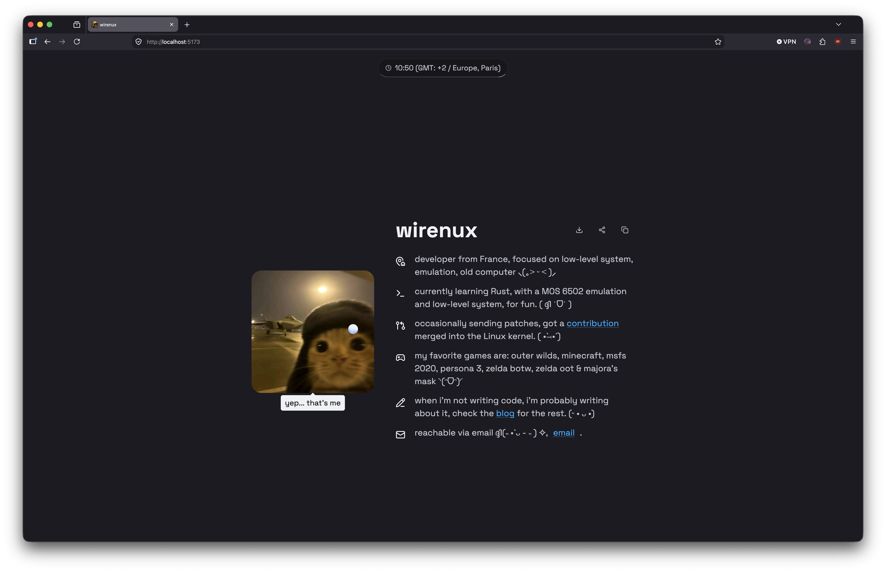

# wirenux.dev

My personal portfolio, built with vanilla HTML, CSS, and JS.

## Preview



## Stack

- **Vite** - dev server & build
- **Pico.css** - base styling
- **Radix Colors** - dark theme palette
- **GSAP** - cursor & animations
- **Lenis** - smooth scroll
- **Simple Icons** - stack section icons

## Features

- Custom cursor (inverts color, morphs on hover)
- Grayscale images that regain color on hover
- Local time in the nav (Europe/Paris)
- Copy bio / share link / download resume buttons

## Run locally

```bash
npm install
npm run dev
```

## Build

```bash
npm run build
npm run preview
```

## License

See [LICENSE](./LICENSE).